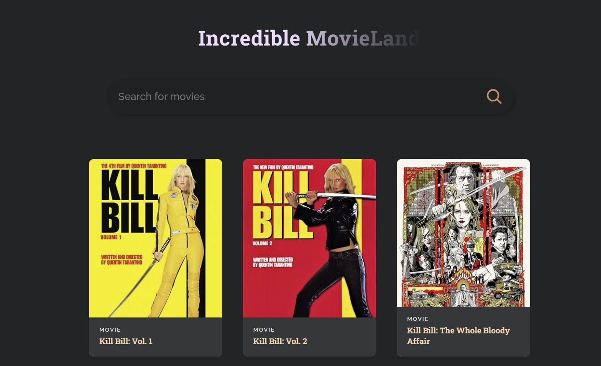
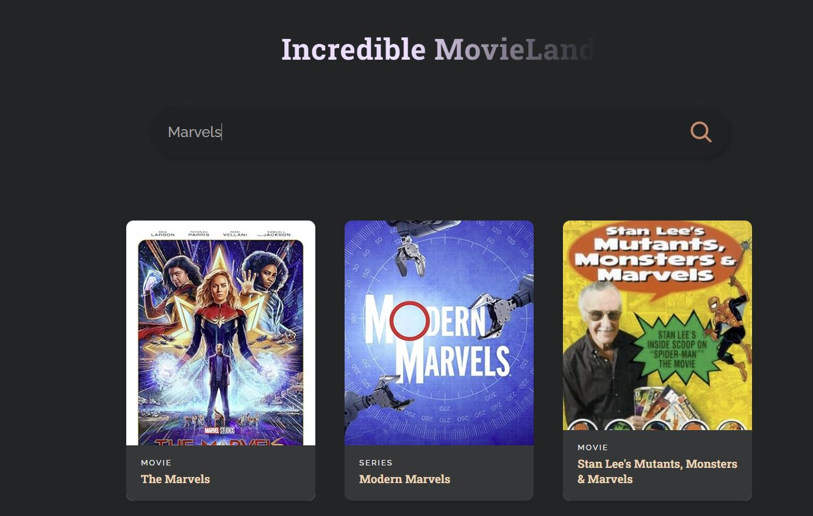

# Movie Search App

This React-based application allows users to search for movies and explore details about them.  Built with Vite for a fast and efficient development experience, the app leverages the OMDb API to fetch movie data.
[Demo](https://roshanrajadhikari.github.io/ReactJS-Movie-Search-App/ "Demo")

## Table of Contents

- [Introduction](#introduction)
- [Features](#features)
- [Technologies Used](#technologies-used)
- [Installation](#installation)
- [Usage](#usage)
- [Project Structure](#project-structure)
- [Screenshots](#screenshots)
  
## Introduction

This project provides a user-friendly interface for searching and browsing movies.  It demonstrates the use of React components, asynchronous data fetching with `fetch` ), and state management to create a dynamic and interactive web application.  The app focuses on providing a smooth search experience and clear presentation of movie information.

## Features

- **Movie Search:** Search for movies by title.
- **Detailed Movie Information:** View details about each movie, including poster, title, year, and other relevant information from the OMDb API. 
- **Responsive Design:**  The app is designed to be responsive and work well on different screen sizes (desktop, tablet, mobile).
- **Error Handling:**  The app handles API errors and displays appropriate messages to the user. 
- **No Results Handling:**  A message is displayed if no movies are found for a given search term. 

## Technologies Used

- React
- Vite
- OMDb API (http://www.omdbapi.com/)
-  fetch

## Installation

1. **Clone the repository:**

   ```bash
   git clone https://github.com/roshanrajadhikari/ReactJS-Movie-Search-App.git

2. **Navigate to project directory:**

   ```bash
   cd ReactJS-Movie-Search-App

3. **Install dependencies:**

   ```bash
   npm install

## Usages

1. **Start the development server:**

   ```bash
   npm run dev

2. **Open your browser:**
   - The app will usually be available at http://localhost:5173 (or the port shown in your terminal).
   - Enter a movie title in the search bar and press Enter or click the search button.

## Screenshots


